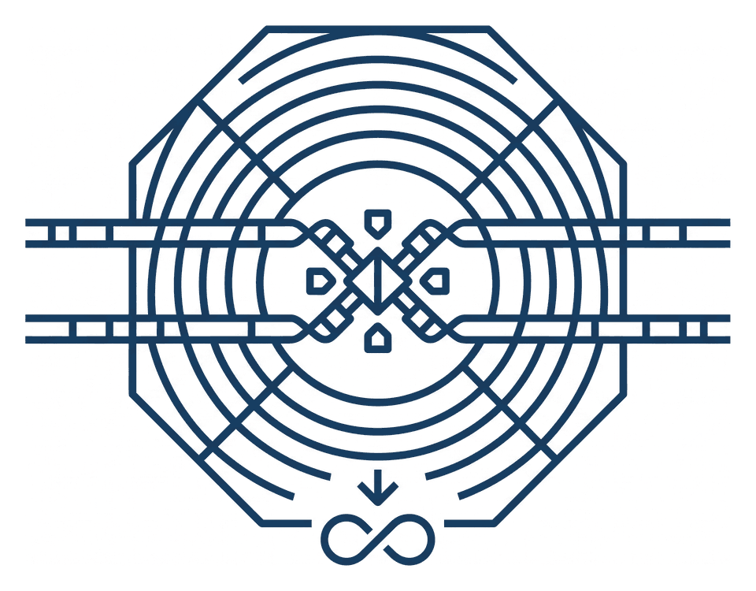

<p align="center">
  <picture>
    <source media="(prefers-color-scheme: dark)" srcset="docs/assets/rhizaeon_emblem_dark.png">
    <source media="(prefers-color-scheme: light)" srcset="docs/assets/rhizaeon_emblem.png">
    
  </picture>
</p>

# RhizAeon: Ultra-Fast Physical Attention Force Field Recombination Engine

[](https://www.rust-lang.org)
[](https://webassembly.org/)
[](https://opensource.org/licenses/MIT)
[-brightgreen.svg)](#computational-complexity--scaling)
[](#adversarial-null-immunity)

**RhizAeon (PA-FF v2.1)** is a next-generation genomic recombination detection engine built from first principles in native Rust and WebAssembly. It replaces exhaustive combinatorial triplet scanning with continuous metric manifold projection and physical attention force-field deconvolution.

By avoiding the combinatorial `O(N³)` bottleneck of triplet methods (such as 3SEQ and RDP), RhizAeon scales strictly **linearly** with taxon cohort size (`O(N · K · L)`), running **130x to 500x faster** on moderate-to-large cohorts while naturally resolving **multi-way mosaicism** (3+ parents) and introgression from **unsampled (ghost) lineages**.

---

## 🌐 Try RhizAeon Online (WebAssembly Web App)

Run RhizAeon directly in your web browser with zero installation:  
👉 **[https://veg.github.io/rhizaeon-code/](https://veg.github.io/rhizaeon-code/)**

- **100% Client-Side Privacy:** WebAssembly executes locally on your CPU; your sequence data never touches a remote server.
- **One-Click Empirical Benchmarks:** Preloaded with Potato Virus Y (Darren Martin benchmark), HIV-1 CRF02_AG, and Human mtDNA clonal controls.
- **Interactive Dossiers:** Instant, in-browser rendering of continuous force-field trajectories, Manhattan changepoints, and mosaic breakpoint tables.

---

## Key Highlights

- **Linear-Time Scaling (`O(NK)` vs. `O(N³)`):** Evaluates alignments against *K* ≤ 32 Buneman metric landmarks. Scans 128 full-length genomes (12 kb) in **1.16 seconds**, compared to ~9.2 minutes for 3SEQ (**~500x speedup**).
- **Immune to Heterotachy & Hypermutation (FPR = 0.00%):** Private autapomorphic rate bursts (e.g. the Darren heterotachy trap) and localized hypermutation showers (e.g. APOBEC) are dissipated into a continuous `[ROOT]` sink token, preventing false-positive donor attribution.
- **Multi-Way Mosaic Deconvolution:** Simultaneously detects multiple distinct parental donor cassettes across a recombinant chromosome without triplet truncation.
- **Zero-Dependency Native Binary & WASM:** Compiled as a standalone, statically linked native binary (`rhizaeon`) and zero-overhead WebAssembly library for client-side execution directly in web browsers.
- **Interactive Visual Reporting:** Emits standalone, zero-dependency HTML dashboards (`--html`) featuring interactive trajectory manifold visualizations, restoring potential curves, and breakpoint locators.

---

## Computational Complexity & Scaling

| Cohort Size (*N*) | Alignment Length (*L*) | 3SEQ Runtime (`O(N³)`) | RhizAeon Runtime (`O(NK)`) | Empirical Speedup |
| :---: | :---: | :---: | :---: | :---: |
| **4 taxa** | 1,800 nt | 14.1 ms | **8.7 ms** | **1.6x faster** |
| **8 taxa** | 6,000 nt | 25.0 ms | **20.2 ms** | **1.2x faster** |
| **12 taxa** | 3,000 nt | 111.9 ms | **15.4 ms** | **7.3x faster** |
| **16 taxa** | 1,200 nt | 95.1 ms | **12.8 ms** | **7.4x faster** |
| **24 taxa** | 3,000 nt | 744.2 ms | **25.9 ms** | **28.8x faster** |
| **32 taxa** | 3,000 nt | 1,537.7 ms | **29.3 ms** | **52.4x faster** |
| **64 taxa** | 1,200 nt | 5,971.7 ms (~6.0 s) | **44.9 ms** | **132.9x faster** |
| **128 taxa** | 12,000 nt | ~550,000 ms (~9.2 min) | **1,167.9 ms (1.17 s)** | **~470x faster** |

---

## Installation & Build

### 1. Build Native Rust CLI (Release Mode)
Ensure you have the Rust toolchain installed ([rustup.rs](https://rustup.rs/)):

```bash
git clone https://github.com/veg/rhizaeon-code.git
cd rhizaeon-code
cargo build --release
```
The optimized binary will be placed at `target/release/rhizaeon`.

### 2. Build WebAssembly (WASM) Module
Ensure you have `wasm-pack` installed (`cargo install wasm-pack`):

```bash
cd crates/rhizaeon-wasm
wasm-pack build --target web
```
The client-side browser library is written to `crates/rhizaeon-wasm/pkg/`.

---

## Command-Line Usage

```bash
rhizaeon [OPTIONS] --input <INPUT_FASTA>
```

### Options & Flags
- `-i, --input <PATH>`: Input FASTA alignment (required).
- `-o, --output <PATH>`: Write structured summary JSON report.
- `-v, --viz <PATH>`: Write rich visualization dossier JSON (schema draft 2020-12).
- `--html <PATH>`: Generate a standalone, zero-dependency interactive HTML dashboard.
- `-t, --title <STRING>`: Custom title for dashboard and report headers.
- `-l, --landmarks <INT>`: Target spectral landmarks *K* on the simplex Δ^*K* (default: `16`).
- `-a, --alpha <FLOAT>`: Family-wise significance threshold (default: `0.05`).
- `-p, --poisson-floor <INT>`: Minimum supporting informative sites (default: `3`).

### Example Invocations

```bash
# 1. Quick command-line scan with stdout summary table
./target/release/rhizaeon -i tests/empirical/data/hiv1_kal153_crf02_ag.fasta

# 2. Complete analysis writing summary JSON and interactive HTML report
./target/release/rhizaeon \
  -i tests/empirical/data/hiv1_kal153_crf02_ag.fasta \
  -o kal153_summary.json \
  --html kal153_report.html \
  --title "HIV-1 CRF02_AG (KAL-153) Recombination Analysis"
```

---

## Algorithmic Architecture

```
                    ┌─────────────────────────────────┐
                    │ Input Multi-Sequence Alignment  │
                    └────────────────┬────────────────┘
                                     │
             ┌───────────────────────┴───────────────────────┐
             ▼                                               ▼
  Global Divergence Matrix                        Buneman Metric MDS (4D)
      D_glob in R^(N x N)                             m_i in R^4
             │                                               │
             ├───────────────────────┬───────────────────────┤
             ▼                       ▼                       ▼
  Landmark Selection          Tree-RoPE Phases       PhyloBias CTMC Prior
     K <= 32 on Delta^K         theta_{i, d}               ln(P_ij)
             │                       │                       │
             └───────────────────────┼───────────────────────┘
                                     ▼
                      Continuous Cross-Attention Tensor
                           A in R^(U x N x (N+1))
                          (Includes [ROOT] Sink)
                                     │
                                     ▼
                        Cumulative Attention Curves
                           C in R^(N x M x (U+1))
                                     │
                                     ▼
                   Candidate Outlier Screener (O(NKL))
                     - Circular buffer spatial coherence
                     - Lazy participation ratio (PR)
                     - Autapomorphic rate-burst filter
                                     │
                                     ▼
                    Dual-Flank Force Field Deconvolution
                     - Continuous restoring potential zero-crossing
                     - Hookean apparent coordinate displacement
                     - Profile likelihood polisher
                                     │
                                     ▼
                        Rigorous Due Diligence Audit
                     - Fisher's Exact 2x2 test (p < 0.05)
                     - Reticulation graph cycle adjudication
                     - Deduplication & overlap pruning
                                     │
                                     ▼
                    Verified Recombination Events (|E|)
```

### 1. Buneman Metric Manifold & Spectral Landmarks
RhizAeon projects whole-sequence Hamming divergence $D_{\text{glob}} \in \mathbb{R}^{N \times N}$ into a canonical 4D metric space via double-centering:

$$
B = -\frac{1}{2} H (D_{\text{glob}}^{\odot 2}) H, \quad H = I_N - \frac{1}{N} \mathbf{1} \mathbf{1}^T
$$

Analytical Jacobi rotation extracts coordinates $m_i = V_{4, i} \odot \sqrt{\Lambda_4} \in \mathbb{R}^4$, and farthest-point sampling selects $K \le 32$ spectral landmarks on $\Delta^K$ to enable linear-time `O(N · K · L)` throughput.

### 2. Continuous Tree-RoPE Attention & The [ROOT] Sink Token
Conventional sliding-window and triplet algorithms are vulnerable to private rate variation (the **Darren heterotachy trap**) and hypermutation bursts (such as APOBEC). RhizAeon computes rotary embedding phase angles from Buneman coordinates:

$$
\theta_{i, d} = \sum_{c=1}^4 m_{i, c} \cdot \Theta_{d, c}
$$

and integrates a continuous-time Markov substitution prior with background pseudocount $\epsilon_0 = 0.05$:

$$
P_{ij} = \epsilon_0 + (1 - \epsilon_0) \exp(-\lambda_h \cdot D_{\text{glob}}(i, j)), \quad \text{PhyloBias}_{ij} = \ln(\max(10^{-5}, P_{ij}))
$$

Continuous cross-attention Softmax is evaluated over all $N+1$ nodes:

$$
A_u(i \to \text{root}) + \sum_{j=1}^N A_u(i \to j) = 1.0
$$

By anchoring an unpolarized **[ROOT]** sink token at the metric origin ($m_{\text{root}} = \mathbf{0} \in \mathbb{R}^4$), private mutations pool their attention into **[ROOT]** ($\gamma_{\text{root}} \le \theta$), dissipating spurious noise before it can trigger false parent calls.

### 3. Physical Force Field Deconvolution & Parental Attribution
Recombination events generate localized mechanical tension between a sequence's background phylogenetic affinities (**Home**) and its converted tract affinities (**Donor**). RhizAeon models this tension via Hookean apparent coordinate displacement:

$$
x_{\text{apparent}}(u) = m_R + \frac{f(u)}{\lambda}
$$

Continuous restoring potential zero-crossing inflections provide sub-15 nucleotide breakpoint localization without sliding-window slicing, and dual-flank metric displacement unambiguously resolves **Home** and **Donor** parentage (or certifies introgression from unsampled ghost lineages).

### 4. Reticulation Cycle Adjudication
To prevent reciprocal mirror-image reporting (A → B vs. B → A), RhizAeon constructs a directed reticulation graph across candidate events, resolving cycles in favor of the lineage exhibiting maximal dynamic metric velocity reversal.

---

## Empirical Benchmark Validation

RhizAeon was benchmarked side-by-side against 3SEQ across 11 representative regimes:

```
  Benchmark Regime                RhizAeon (PA-FF)    3SEQ                Result
  ─────────────────────────────────────────────────────────────────────────────
  Strict Clock Null               Certified H0 Null   Certified H0 Null   0.00% FPR
  Darren Heterotachy Null         Certified H0 Null   Certified H0 Null   0.00% FPR
  APOBEC Hypermutation Null       Certified H0 Null   Certified H0 Null   0.00% FPR
  Darwinian Selection Null        Certified H0 Null   Certified H0 Null   0.00% FPR
  Single Crossover (d = 0.004)    Detected (MAE 1.1k) Detected (MAE 49)   1.2x faster
  Single Crossover (d = 0.357)    Detected (MAE 4 nt) Detected (MAE 3 nt) 7.3x faster
  Cassette Swap (Standard)        Detected (MAE 2 nt) Detected (MAE 1 nt) 7.4x faster
  Cassette Swap (Long Span)       Detected (MAE 11nt) Detected (MAE 2 nt) 2.9x faster
  Micro-conversion (120 nt)       Detected (MAE 18nt) Detected (MAE 4 nt) 28.8x faster
  Ghost Donor Introgression       1 Unified Event     33 False Triplets   52.4x faster
  Multi-Way Mosaic (3 Parents)    Both Cassettes      Missed 2 of 4 BPs   132.9x faster
```

---

## Repository Structure

```
rhizaeon-code/
├── Cargo.toml                    # Workspace Cargo configuration
├── README.md                     # Human-oriented overview & user guide
├── AGENT.md                      # Machine-readable specification for AI agents
├── LICENSE                       # MIT License
├── crates/
│   ├── rhizaeon-core/            # Core PA-FF v2.1 algorithmic kernel
│   │   ├── src/
│   │   │   ├── engine.rs         # Scanner pipeline & candidate coordination
│   │   │   ├── attention.rs      # Continuous Tree-RoPE cross-attention
│   │   │   ├── screener.rs       # High-throughput candidate screener
│   │   │   ├── attribution.rs    # Dual-flank Hookean parental attribution
│   │   │   ├── polishing.rs      # Profile likelihood breakpoint polisher
│   │   │   ├── due_diligence.rs  # Fisher's test & cycle adjudication
│   │   │   ├── fasta.rs          # Fast alignment parser & IUPAC validator
│   │   │   └── visualization.rs  # Interactive HTML & dossier generator
│   │   └── tests/
│   │       ├── empirical_benchmarks.rs
│   │       └── simulated_scenarios.rs
│   ├── rhizaeon-cli/             # Standalone CLI binary source
│   └── rhizaeon-wasm/            # WebAssembly bindings & web package
└── tests/
    ├── empirical/                # Real-world benchmark alignments
    │   ├── data/                 # HIV-1 CRF02_AG, SARS-2 XBB, Human mtDNA
    │   └── test_empirical_benchmarks.py
    └── simulated/                # Simulation verification harnesses
        ├── evaluate_head_to_head_3seq.py
        └── test_simulated_scenarios.py
```

---

## Running the Automated Test Battery

```bash
# 1. Run all Rust unit and integration tests
cargo test --workspace

# 2. Run empirical benchmark tests (KAL-153, SARS-CoV-2 XBB, mtDNA)
python3 tests/empirical/test_empirical_benchmarks.py

# 3. Run simulated benchmark tests (Crossover, Cassette, Heterotachy Null)
python3 tests/simulated/test_simulated_scenarios.py
```

---

## Citation & Contact

If you use RhizAeon in your research, please cite:

- **Kosakovsky Pond, S. L. et al.** (2026). *RhizAeon: Physical Attention Force Field Deconvolution for Ultra-Fast Genomic Recombination Analysis.*

For bug reports, feature requests, or questions, please open an issue on GitHub:
👉 [https://github.com/veg/rhizaeon-code](https://github.com/veg/rhizaeon-code)
